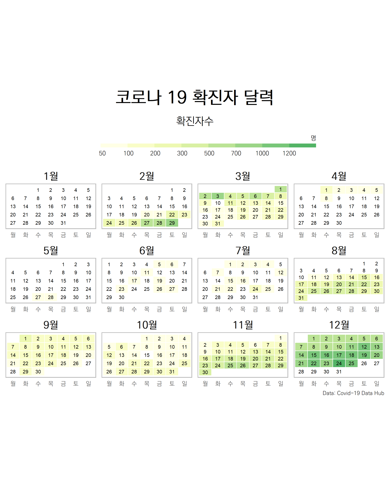
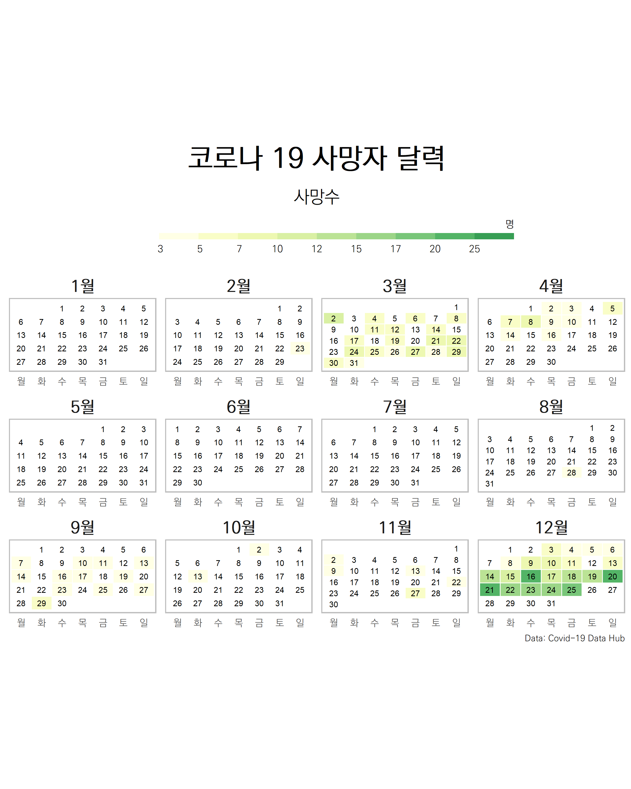

```{r setup, include=FALSE}
knitr::opts_chunk$set(echo = TRUE, message=FALSE, warning=FALSE,
                      comment="", digits = 3, tidy = FALSE, prompt = FALSE, fig.align = 'center')

```


# COVID-19 데이터 {#load-data}

[`COVID19`](https://cran.r-project.org/web/packages/COVID19/) 팩키지를 통해 대한민국을 비롯한 각국 코로나19 데이터를 손쉽고 정확하게 얻을 수 있다 [@Guidotti2020]. [`COVID19`](https://cran.r-project.org/web/packages/COVID19/) 팩키지에서 일별 확진자 사망자 데이터가 포함된 데이터를 준비한다.

```{r load-data}
library(tidyverse)
library(COVID19)
library(timetk)

korea_dat <- covid19("KOR", level = 1)

korea_df <- korea_dat %>% 
  ungroup() %>% 
  dplyr::select(날짜=date, 누적검사자=tests, 누적확진자=confirmed, 누적회복자=recovered, 누적사망자=deaths) %>% 
  timetk::pad_by_time(.date_var = 날짜, .by = "day", .pad_value = NA) %>% 
  mutate(누적검사자 = timetk::ts_impute_vec(누적검사자, period = 1) %>%  ceiling(.),
         누적회복자 = ifelse(is.na(누적회복자), 0, 누적회복자),
         누적사망자 = ifelse(is.na(누적사망자), 0, 누적사망자))

korea_df %>% 
  reactable::reactable()
```

# 확진자 달력 [^calendar-ts] {#COVID-19-calendar}

[^calendar-ts]: [Dominic Roye (2020-12-20), "A heatmap as calendar", geographic data - Understanding the World](https://dominicroye.github.io/en/2020/a-heatmap-as-calendar/)

["A heatmap as calendar"](https://dominicroye.github.io/en/2020/a-heatmap-as-calendar/) 블로그를 참고하여 누적확진자에서 일별 확진자를 준비한다.

```{r calendar-covid-19}
confirmed_daily_tbl <- korea_df %>% 
  mutate(확진자 = 누적확진자 - lag(누적확진자, n = 1L)) %>% 
  drop_na() %>% 
  select(날짜, 확진자)

confirmed_daily_tbl %>% 
  arrange(desc(날짜)) %>% 
  reactable::reactable()
```

확진자에 대한 달력 시각화를 위한 `ggplot` 시각화 데이터를 준비한다.

```{r calendar-covid-19-preprocessing}
if(!require("tidyverse")) install.packages("tidyverse")
if(!require("ragg"))      install.packages("ragg")
if(!require("lubridate")) install.packages("lubridate")

confirmed_prep_daily_tbl <- confirmed_daily_tbl %>% 
          complete(날짜 = seq(ymd("2020-01-01"), 
                              ymd("2020-12-31"), 
                              "day")) %>%
          mutate(weekday = wday(날짜, label = TRUE, week_start = 1), 
                 month   = month(날짜, label = TRUE, abbr = FALSE),
                 week    = isoweek(날짜),
                 day     = day(날짜)) %>% 
  mutate(확진자 = ifelse(is.na(확진자), 0, 확진자))


confirmed_prep_daily_tbl <- confirmed_prep_daily_tbl %>% 
  mutate(week = case_when(month == "12월" & week == 1 ~ 53,
                          month == "1월"  & week %in% 52:53 ~ 0,
                          TRUE ~ week),
                 확진구간 = cut(확진자, c(-1, 50, 100, 200, 300, 500, 700, 1000, 1200, Inf)))
      
confirmed_prep_daily_tbl  
```


`theme_calendar`를 그대로 폰트만 바꿔 준비하고 확진자에 대한 시각화를 한다.

```{r calendar-covid-19-heatmap, fig.width= 12, fig.height=9, eval = FALSE}
library(RColorBrewer)
library(extrafont)
loadfonts()

YlGn <- RColorBrewer::brewer.pal(9, "YlGn")
col_p <- colorRampPalette(YlGn)

theme_calendar <- function(){

 theme(aspect.ratio = 1/2,
       
       axis.title = element_blank(),
       axis.ticks = element_blank(),
       axis.text.y = element_blank(),
       axis.text = element_text(family = "KoPubWorldDotum Light"),
       
       panel.grid = element_blank(),
       panel.background = element_blank(),
       
       strip.background = element_blank(),
       strip.text = element_text(family = "KoPubWorldDotum Light", face = "bold", size = 15),
       
       legend.position = "top",
       legend.text = element_text(family = "KoPubWorldDotum Light", hjust = .5),
       legend.title = element_text(family = "KoPubWorldDotum Light", size = 9, hjust = 1),
       
       plot.caption =  element_text(family = "KoPubWorldDotum Light", hjust = 1, size = 8),
       panel.border = element_rect(colour = "grey", fill=NA, size=1),
       plot.title = element_text(family = "KoPubWorldDotum Light", hjust = .5, size = 26, 
                                 face = "bold", 
                                 margin = margin(0,0,0.5,0, unit = "cm")),
       plot.subtitle = element_text(family = "KoPubWorldDotum Light", hjust = .5, size = 16)
  )
}

confirmed_prep_daily_tbl %>% 
    ggplot(aes(weekday, -week, fill = 확진구간)) +
      geom_tile(colour = "white", size = .4)  + 
      geom_text(aes(label = day, colour = "black"), size = 2.5) +
      guides(fill = guide_colorsteps(barwidth = 25, 
                                     barheight = .4,
                                    title.position = "top")) +
       scale_fill_manual(values = c("white", col_p(13)),
                         na.value = "grey90", drop = FALSE) +
       scale_colour_manual(values = c("black", "white"), guide = FALSE) + 
       facet_wrap(~ month, nrow = 3, ncol = 4, scales = "free") +
       labs(title = "코로나 19 확진자 달력", 
             subtitle = "확진자수",
             caption = "Data: Covid-19 Data Hub",
             fill = "명") +
       theme_calendar()

ggsave("fig/confirmed_calendar.png", height = 10, width = 8, device = agg_png())
```



# 사망자 달력  {#COVID-19-calendar-death}

동일한 데이터에서 사망자를 추출한다.

```{r calendar-covid-19-death}
confirmed_death_daily_tbl <- korea_df %>% 
  mutate(사망자 = 누적사망자 - lag(누적사망자, n = 1L)) %>% 
  drop_na() %>% 
  select(날짜, 사망자)

confirmed_death_daily_tbl %>% 
  arrange(desc(날짜)) %>% 
  reactable::reactable()
```

사망자에 대한 달력 시각화를 위한 `ggplot` 시각화 데이터를 준비한다.

```{r calendar-covid-19-preprocessing-death}

confirmed_death_daily_tbl <- confirmed_death_daily_tbl %>% 
          complete(날짜 = seq(ymd("2020-01-01"), 
                              ymd("2020-12-31"), 
                              "day")) %>%
          mutate(weekday = wday(날짜, label = TRUE, week_start = 1), 
                 month   = month(날짜, label = TRUE, abbr = FALSE),
                 week    = isoweek(날짜),
                 day     = day(날짜)) %>% 
  mutate(사망자 = ifelse(is.na(사망자), 0, 사망자))


confirmed_death_daily_tbl <- confirmed_death_daily_tbl %>% 
  mutate(week = case_when(month == "12월" & week == 1 ~ 53,
                          month == "1월"  & week %in% 52:53 ~ 0,
                          TRUE ~ week),
                 사망자구간 = cut(사망자, c(-1, 3, 5, 7, 10, 12, 15, 17, 20, 25, Inf)))
      
confirmed_death_daily_tbl  
```


`theme_calendar`를 그대로 폰트만 바꿔 준비하고 사망자에 대한 시각화를 한다.

```{r calendar-covid-19-heatmap-death, fig.width= 12, fig.height=9, eval = FALSE}

confirmed_death_daily_tbl %>% 
    ggplot(aes(weekday, -week, fill = 사망자구간)) +
      geom_tile(colour = "white", size = .4)  + 
      geom_text(aes(label = day, colour = "black"), size = 2.5) +
      guides(fill = guide_colorsteps(barwidth = 25, 
                                     barheight = .4,
                                    title.position = "top")) +
       scale_fill_manual(values = c("white", col_p(13)),
                         na.value = "grey90", drop = FALSE) +
       scale_colour_manual(values = c("black", "white"), guide = FALSE) + 
       facet_wrap(~ month, nrow = 3, ncol = 4, scales = "free") +
       labs(title = "코로나 19 사망자 달력", 
             subtitle = "사망수",
             caption = "Data: Covid-19 Data Hub",
             fill = "명") +
       theme_calendar()

ggsave("fig/death_calendar.png", height = 10, width = 8, device = agg_png())
```



