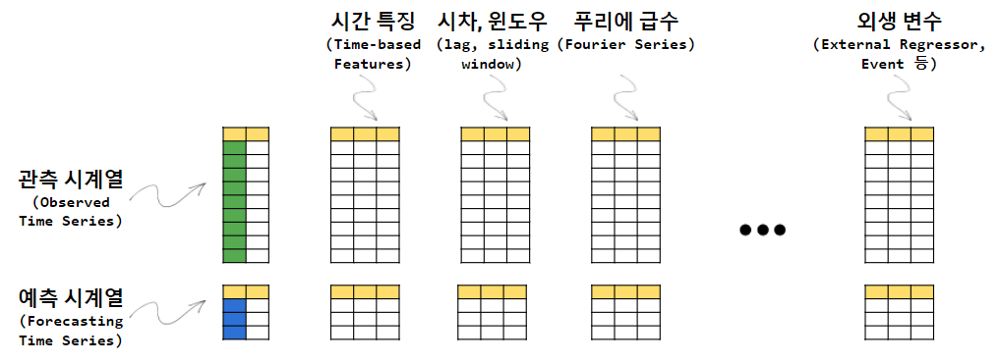

```{r setup, include=FALSE}
knitr::opts_chunk$set(echo = TRUE, message=FALSE, warning=FALSE,
                      comment="", digits = 3, tidy = FALSE, prompt = FALSE, fig.align = 'center')

```


# 자료구조 {#forecasting-data-structure}




# 피처 공학 {#feature-engineering}


# 예측 모형 {#forecasting-model}

# 자동화 엔지니어링 {#automation-engineering}


