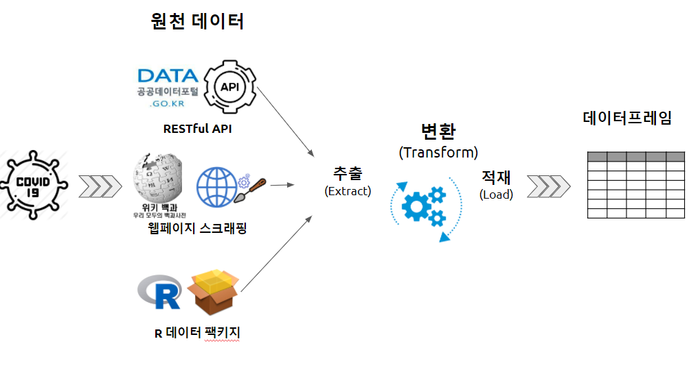

```{r setup, include=FALSE}
knitr::opts_chunk$set(echo = TRUE, message=FALSE, warning=FALSE,
                      comment="", digits = 3, tidy = FALSE, prompt = FALSE, fig.align = 'center')

```


# 작업 흐름 {#get-corona-dataset-workflow}

코로나 19 관련 데이터를 입수하는 방식은 크게 3가지로 나눌 수 있다.

- [API]: [공공데이터포털](https://www.data.go.kr/index.do) 웹사이트에서 코로나19 감염 현황에 대한 API를 제공하는 방법
- [웹스크래핑]: 위키백과사전 [대한민국의_코로나19_범유행](https://ko.wikipedia.org/wiki/대한민국의_코로나19_범유행) 웹페이지에서 코로나19 확진자 현황 데이터를 추출한다. 
- [R 데이터 팩키지]: [`COVID19`](https://cran.r-project.org/web/packages/COVID19/) 팩키지를 통해 대한민국을 비롯한 각국 코로나19 데이터를 손쉽고 정확하게 얻을 수 있다 [@Guidotti2020]. 


