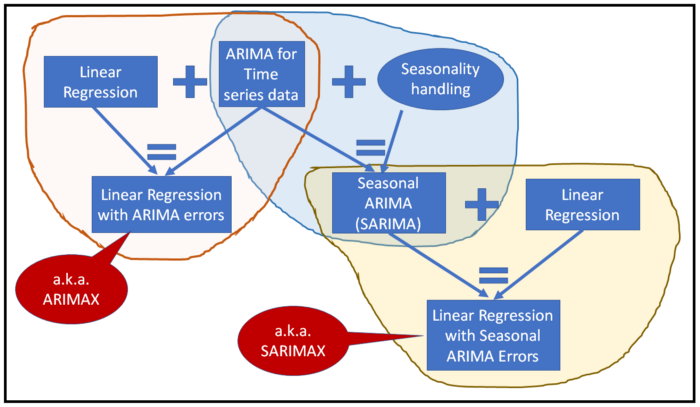

```{r setup, include=FALSE}
knitr::opts_chunk$set(echo = TRUE, message=FALSE, warning=FALSE,
                      comment="", digits = 3, tidy = FALSE, prompt = FALSE, fig.align = 'center')

```


# 시계열 + 회귀 모형  [^regression-with-arima] {#corona-forecast-helloword}

[^regression-with-arima]: [Sachin (2020-09-09), "Regression with ARIMA Errors -What is it, why do we need it, when to use it, how to build it using Python and statsmodels", towards data science ](https://towardsdatascience.com/regression-with-arima-errors-3fc06f383d73)

ARIMA 시계열 모형과 회귀모형을 결합할 경우 흥미로운 결과를 도출할 수 있다.


- ARIMAX: 선형 회귀모형 + ARIMA 시계열 모형
- SARIMAX: 선형 회귀모형 + 계절 ARIMA (Seasonal ARIMA)




수식으로 표현하면 다음과 같다.

$$y_i = \hat{\beta} x_i + \epsilon_i \\
\epsilon_i \sim ARIMA(p,d,q)(P,D,Q)[m] $$

여기서 $\epsilon_i$를 계절 $ARIMA(p,d,q)(P,D,Q)[m]$ 시계열 모형으로 식별한다.


# 데이터 자료구조 {#data-structure}


[UCI Machine Learning Repository: Air Quality Data Set](https://archive.ics.uci.edu/ml/datasets/Air+quality)를 상기 모형을 예측하는 데이터로 활용한다. 이탈리아 도시에서 IoT 센서를 통해 공기오염을 측정한 데이터다.

시간별로 다양한 센서를 통해 대기상태를 측정하는 것은 물론 해당 시간의 온도, 습도도 측정한다.

<https://archive.ics.uci.edu/ml/datasets/Air+quality>

- `date_time`    : Date (DD/MM/YYYY) Time (HH.MM.SS)
- `co_gt`        : True hourly averaged concentration CO in mg/m^3 (reference analyzer)
- `pt08_s1_co`   : PT08.S1 (tin oxide) hourly averaged sensor response (nominally CO targeted)
- `nmhc_gt`      : True hourly averaged overall Non Metanic HydroCarbons concentration in microg/m^3 (reference analyzer)
- `c6h6_gt`      : True hourly averaged Benzene concentration in microg/m^3 (reference analyzer)
- `pt08_s2_nmhc` : PT08.S2 (titania) hourly averaged sensor response (nominally NMHC targeted)
- `n_ox_gt`      : True hourly averaged NOx concentration in ppb (reference analyzer)
- `pt08_s3_n_ox` : PT08.S3 (tungsten oxide) hourly averaged sensor response (nominally NOx targeted)
- `no2_gt`       : True hourly averaged NO2 concentration in microg/m^3 (reference analyzer)
- `pt08_s4_no2`  : PT08.S4 (tungsten oxide) hourly averaged sensor response (nominally NO2 targeted)
- `pt08_s5_o3`   : PT08.S5 (indium oxide) hourly averaged sensor response (nominally O3 targeted)
- `t`            : Temperature in °C
- `rh`           : Relative Humidity (%)
- `ah`           : AH Absolute Humidity


```{r reg-arima-data-structure}
library(tidyverse)

# air_dat <- read_csv("https://gist.githubusercontent.com/sachinsdate/2f4fb513f3a5ca367ae1866e3f5b8613/raw/df4f6395f35f58bb59999e8ff11336f5bc5d76b9/air_quality_uci_mod.csv")

air_dat <- read_delim("data/AirQualityUCI.csv", delim = ";") 
  
air_df <- air_dat %>% 
  # 변수명 확인
  janitor::clean_names() %>% 
  
  # 결측값이 포함된 행과 칼럼 제거
  filter(!is.na(date)) %>% 
  select(-x16, -x17) %>% 
  
  # 날짜와 시간을 결합하여 날짜시각형으로 자료변환
  tidyr::unite("date_time", date:time) %>% 
  mutate(date_time = lubridate::dmy_hms(date_time)) %>% 
  
  # 소수점이 ,로 구분된 문자형 변수를 숫자형 변수로 변환
  mutate(across(.cols = where(is.character), .fns = ~ str_replace(.x, ",", ".") %>% as.numeric)) %>% 
  
  # 시간순으로 정렬  
  arrange(date_time)

air_df %>% 
  slice(1:100) %>% 
  reactable::reactable()

```

불러들인 날짜 시각에 대한 데이터 정합성 확인을 선제적으로 진행한다. 
먼저, 시작시각과 종료시각을 파악하자. 2004년 3월부터 2005년 4월까지 대략 1년이 조금 넘는 기간 다양한 센서를 활용하여 공기에 포함된 화학물질을 측정한 데이터로 확인된다.

```{r reg-arima-data-structure-start}
library(timetk)

air_df %>% 
  summarise(시작시각 = min(date_time),
            종료시각 = max(date_time))
```

불러들인 데이터의 행의 갯수를 `r nrow(air_df)` 파악하고 `pad_by_time()` 함수로 교차확인하여 결측값이 없음을 확인한다.

```{r reg-arima-data-structure-check}
library(timetk)

air_df %>% 
  pad_by_time(.date_var = date_time, .by = "h", .pad_value = NA) %>% 
  nrow()
```

# 시각화 {#air-time-series}

시간 단위로 데이터가 너무 많아 시각화를 하는데 시간이 많이 걸리기 때문에 일별로 $\frac{1}{24}$ 비율로 압축하여 일별 센서 측정값을 시각화한다.

```{r reg-arima-data-structure-viz}
air_df %>% 
  pivot_longer(-date_time, names_to = "센서", values_to = "측정값") %>% 
  group_by(센서) %>%
  
  # 각 센서별 일별 측정값을 평균
  summarise_by_time(.date_var  = date_time, 
                    .by        = "day",
                    일평균     = mean(측정값, na.rm = TRUE)) %>% 
  ungroup() %>% 
  
  # 각 센서별 일별 시계열 시각화
  plot_time_series(.date_var   = date_time, 
                   .value      = 일평균, 
                   .facet_var  = 센서, 
                   .facet_ncol = 4)

```


# 탐색적 데이터 분석 {#air-pollution-EDA}

본격적인 회귀분석 예측모형을 구축하기에 앞서 시각화를 통한 탐색적 데이터 분석을 통해 데이터에 대한 이해를 높여간다.

## 시각화 {#air-pollution-regression-viz}

시각적으로 보면 특정시간에 측정값이 이상값으로 확인이 된다.

```{r pt08-viz}
air_df %>% 
  select(date_time, pt08_s4_no2, t, ah) %>% 
  pivot_longer(-date_time, names_to = "센서", values_to = "측정값") %>% 
  # 각 센서별 일별 시계열 시각화
  plot_time_series(.date_var   = date_time, 
                   .value      = 측정값, 
                   .facet_var  = 센서, 
                   .facet_ncol = 3)
```

## 이상점(Anomaly) {#air-pollution-anomaly}

`alpha` 값을 조절하여 이상치에 해당되는 특이점을 식별한다.

```{r pt08-viz-anomaly}
air_df %>% 
  select(date_time, pt08_s4_no2, t, ah) %>% 
  pivot_longer(-date_time, names_to = "센서", values_to = "측정값") %>% 
  # 각 센서별 일별 시계열 시각화
  plot_anomaly_diagnostics(.date_var   = date_time, 
                           .value      = 측정값, 
                           .facet_var  = 센서, 
                           .facet_ncol = 3,
                           .alpha    = 0.04
  )
```

`ah` 변수의 이상점이 대체로 다른 두 변수와 일치하기 때문에 해당되는 날을 찾아낸다.
`tk_anomaly_diagnostics()` 함수를 사용해서 이상점 진단결과 
`anomaly == "Yes"`를 찾아내거나 `observed == "-200"`을 통해 동일함을 확인할 수 있다.

```{r}
air_df %>% 
  select(date_time, ah) %>% 
  tk_anomaly_diagnostics(.date_var = date_time,
                         .value    = ah, 
                         .alpha    = 0.01) %>% 
  # filter(anomaly == "Yes") %>% 
  filter(observed == "-200")

anomaly_date_time <- air_df %>% 
  select(date_time, ah) %>% 
  tk_anomaly_diagnostics(.date_var = date_time,
                         .value    = ah, 
                         .alpha    = 0.01) %>% 
  # filter(anomaly == "Yes") %>% 
  filter(observed == "-200") %>% 
  pull(date_time)
```

이상점을 일차로 결측값으로 채워넣고 측정시각마다 생겨난 결측값 구명을 선형보간을 통해 매워넣자.

```{r pt08-viz-anomaly-detect}
air_df %>% 
  select(date_time, ah) %>% 
  mutate(ah = ifelse(date_time %in% anomaly_date_time, NA, ah)) %>% 
  mutate(ah = ts_impute_vec(ah, period = 1)) %>% 
  plot_time_series(.date_var  = date_time, 
                   .value     = ah)
```

## 데이터 정제 {#air-pollution-anomaly-impute}

앞서 이상점(anomaly)을 탐지하는 알고리즘을 특정했다면 나머지 변수에도 동일하게 적용하여 센서에서 나온 이상값을 선형보간을 통해 문제점을 봉합시킨다. 

```{r pt08-viz-anomaly-impute}
air_fixed_df <- air_df %>% 
  
  # 회귀모형 연관 변수만 추출
  select(date_time, pt08_s4_no2, t, ah) %>% 
  
  # 이상점을 특정하고 난 후 결측값으로 채워넣고, 결측값을 선형보간으로 이상점을 보완함.
  mutate(across(.cols = pt08_s4_no2:ah, .fns =  ~ ifelse(date_time %in% anomaly_date_time, NA, .x))) %>% 
  mutate(across(.cols = pt08_s4_no2:ah, .fns =  ~ ts_impute_vec(.x, period = 1)))

air_fixed_df %>% 
  # 이상점을 보완한 후 시각화를 통해 수정사항을 확인함.
  pivot_longer(-date_time, names_to = "센서", values_to = "측정값") %>% 
  plot_time_series(.date_var   = date_time, 
                   .value      = 측정값, 
                   .facet_var  = 센서, 
                   .facet_ncol = 3)

```


# 회귀모형 {#air-pollution-regression}

종속변수 `pt08_s4_no2`을 두 독립변수 온도(`t`)와 절대습도(`ah`)으로 회귀모형을 만들어야 한다.
수식으로 표현하면 다음과 같다.

$$\text{PT08_S4_NO2} = f(T, AH) \\
  \text{PT08_S4_NO2} = \beta_0 + \beta_1 \times T + \beta_2 \times AH + \epsilon)$$


## 훈련/시험 데이터 분리 {#split-train-test}

예측 기계학습 모형을 시계열 데이터를 가지고 개발할 경우 한가지 커다란 차이점은 아마도 예측미래 시점에 대한 데이터를 준비하는 것이 될 것이다. 이를 위해서 `future_frame()` 함수를 사용한다. 이번 경우는 3가지 서로 다른 단변량 시계열 데이터를 대상으로 하기 때문에 `group_by()` 함수를 사용해서 동시에 3가지 데이터프레임을 미래시점까지 포함하여 준비한다. 여기서 미래시점은 $28일 \times 24시간$ 으로 예측시간을 잡는다.

```{r full-data}
library(tidymodels)

air_fixed_df %>% 
  # 회귀모형 연관 변수만 추출
  select(date_time, pt08_s4_no2, t, ah) %>% 
  pivot_longer(-date_time, names_to = "센서", values_to = "측정값") %>% 
  group_by(센서) %>% 
  future_frame(date_time, .length_out = 28 * 24, .bind_data = TRUE) %>% 
  plot_time_series(.date_var = date_time,
                   .value    = 측정값)

full_tbl <- air_fixed_df %>% 
  # 회귀모형 연관 변수만 추출
  select(date_time, pt08_s4_no2, t, ah) %>% 
  pivot_longer(-date_time, names_to = "센서", values_to = "측정값") %>% 
  group_by(센서) %>% 
  future_frame(date_time, .length_out = 28 * 24, .bind_data = TRUE) %>% 
  ungroup() %>% 
  pivot_wider(id_cols = date_time, names_from = 센서, values_from = 측정값)
```

`full_tbl` 전체 시계열 데이터를 먼저 미래시점 데이터(`forecast_tbl`)와 훈련/시험 데이터로 구분한다.

```{r split-data}
# 미래 예측시점

forecast_tbl <- full_tbl  %>% 
  filter(is.na(pt08_s4_no2))

# 관측된 시계열 데이터

history_tbl <- full_tbl  %>% 
  filter(!is.na(pt08_s4_no2))

# 훈련 시험 데이터 분리

splits <- history_tbl %>% 
  time_series_split(.date_var  = date_time,
                    assess     = 28 * 24,
                    cumulative = TRUE)

splits
```

ARIMA + 선형 회귀모형 적합에 사용할 시계열 데이터를 시각화하여 훈련기간과 시험기간이 제대로 준비되었는지 점검한다.

```{r split-data-viz}
splits %>% 
  tk_time_series_cv_plan() %>%
  # plot_time_series_cv_plan(.date_var  = date_time,
  #                          .value     = pt08_s4_no2)
  pivot_longer(pt08_s4_no2:ah, names_to = "센서", values_to = "측정값") %>% 
  plot_time_series(.date_var    = date_time,
                   .value       = 측정값,
                   .facet_var   = 센서,
                   .color_var   = .key,
                   .interactive = FALSE)
```

## 피처공학 {#air-feature-engineering}

`tidymodels` 생태계의 `recipe` 팩키지 `recipe()` 함수를 사용해서 피쳐 공학(feature engineering) 작업을 수행한다.
추후, 다양한 피처를 작업할 예정이라 대략적인 틀만 잡아둔다.

```{r feature-engineering}
recipe_spec <- recipes::recipe(pt08_s4_no2 ~ date_time + t + ah, data = training(splits))

recipe_spec %>% prep() %>%  juice()
```

## 모형적합 {#air-model-fit}

자기상관, 편자기상관 플롯을 바탕으로 식별된 `SARIMAX(1,1,0)(0,1,0)[24]` 모형을 그대로 `arima_reg()` 모형에 넣어 학습을 시킨다.

그리고 `fit()` 함수를 사용해서 적합을 시킨다.

```{r fit-model}
library(modeltime)

model_spec <- arima_reg(
                mode = "regression",
                seasonal_period = 24,
                non_seasonal_ar = 1,
                non_seasonal_differences = 1,
                non_seasonal_ma = 0,
                seasonal_ar = 0,
                seasonal_differences = 1,
                seasonal_ma = 1) %>% 
             set_engine("arima")

wkfl_fit_lm <- workflow() %>% 
  add_recipe(recipe_spec) %>% 
  add_model(model_spec) %>% 
  fit(data = training(splits))

wkfl_fit_lm
```

## 모형 평가 {#air-model-evaluate}

`workflow` 객체를 `modeltime` 팩키지 `modeltime_table()` 함수에 넣어 객체로 만든 후에 
`modeltime_accuracy()` 함수를 사용해서 모형 성능을 파악한다.

```{r air-evaluate-model-performance}

model_tbl <- modeltime_table(
    wkfl_fit_lm
)

model_tbl %>% 
  modeltime::modeltime_accuracy(testing(splits))
```


시험데이터를 통해 모형으로 예측한 값을 시각화한다. $R^2$ 값도 55%가 나오는데 시각화를 하니 변동성은 그럭저럭 잡아가는 것으로 보이나 평균값은 일정부분 떨어져 편이가 발생된 것이 시각적으로 파악된다.

```{r evaluate-model-calibaration}
calibration_tbl <- model_tbl %>% 
  modeltime_calibrate(
    new_data = testing(splits)
  )

calibration_tbl %>% 
    modeltime_forecast(
        new_data      = testing(splits),
        actual_data   = history_tbl,
        conf_interval = 0.10
    ) %>%
    plot_modeltime_forecast(
        .legend_max_width = 60,
        .legend_show = FALSE,
        .conf_interval_show = TRUE,
        .conf_interval_alpha = 0.20,
        .conf_interval_fill = "lightblue",
        .title = "공기오염 ARIMA + 회귀모형 예측"
    )
```

# 수정 회귀모형 {#air-pollution-regression2}

## 모형적합 {#air-model-fit}

앞서 데이터에 적합시킨 모형이 `SARIMAX(1,1,0)(0,1,1)[24]`인데, 
차분을 적용시키지 않은 `SARIMAX(1,0,0)(0,1,1)[24]` 모형을 적합시켜 학습시킨다.

```{r fit-model2}
model_spec2 <- arima_reg(
                mode = "regression",
                seasonal_period = 24,
                non_seasonal_ar = 1,
                non_seasonal_differences = 0,
                non_seasonal_ma = 0,
                seasonal_ar = 0,
                seasonal_differences = 1,
                seasonal_ma = 1) %>% 
             set_engine("arima")

wkfl_fit_lm2 <- workflow() %>% 
  add_recipe(recipe_spec) %>% 
  add_model(model_spec2) %>% 
  fit(data = training(splits))

wkfl_fit_lm2
```

## 모형 평가 {#air-model-evaluate2}

`workflow` 객체를 `modeltime` 팩키지 `modeltime_table()` 함수에 넣어 
앞서 적합시킨 두가지 모형을 동시에 넣어 서로 비교할 수 있도록 준비하여 
`modeltime_accuracy()` 함수를 사용해서 모형 성능을 파악한다.

MAE 값이 100가까이 상당히 개선된 것을 확인할 수 있다.

```{r air-evaluate-model-performance2}

model_tbl <- modeltime_table(
    wkfl_fit_lm,
    wkfl_fit_lm2
) %>% 
  update_model_description(1, "SARIMAX(1,1,0)(0,1,1)[24]") %>% 
  update_model_description(2, "SARIMAX(1,0,0)(0,1,1)[24]")

model_tbl %>% 
  modeltime::modeltime_accuracy(testing(splits))
```

시험데이터를 통해 모형으로 예측한 값을 시각화화 해보면 두번째 모델이 첫번째 모형과 비교하여 편이(bias)를 상당부분 개선한 것을 확인할 수 있다. 하지만, 분산에 대한 부분은 이전모형과 비교해볼 때 그다지 개선된 것이 확인되지 않고 있다.

```{r evaluate-model-calibaration2}
calibration_tbl <- model_tbl %>% 
  modeltime_calibrate(
    new_data = testing(splits)
  )

calibration_tbl %>% 
    modeltime_forecast(
        new_data      = testing(splits),
        actual_data   = history_tbl,
        conf_interval = 0.10
    ) %>%
    plot_modeltime_forecast(
        .legend_max_width = 60,
        .legend_show = TRUE,
        .conf_interval_show = TRUE,
        .conf_interval_alpha = 0.20,
        .conf_interval_fill = "lightblue",
        .title = "공기오염 ARIMA + 회귀모형 예측 (개선)"
    )
```


# 공기 오염 예측 {#air-model-forecast}

앞선 모형은 `history_tbl` 을 훈련/시험 데이터에 대해 적합을 시킨 것이라 ... 이제 시간을 확대하여 `modeltime_refit()` 함수를 사용해서 모형을 전체 데이터에 대해 다시 적합시킨다. 
마지막으로 앞서 구축된 모형을 바탕으로 현재까지 입수된 데이터를 바탕으로 한달 후($28일 \times 24시간$)를 예측한다.

```{r air-evaluate-model-forecast-refit}
refit_tbl <- calibration_tbl %>% 
  modeltime_refit(data = history_tbl)

refit_tbl %>% 
  filter(.model_id == 2) %>% 
  modeltime_forecast(
    new_data    = forecast_tbl,
    actual_data = history_tbl,
    conf_interval = 0.9
  )  
```

하지만, 예측값을 반환하지 못하는데 이유는 `t`, `ah` 값이 존재하지 않기 때문에 당연히 예측을 할 수 없다.

```{r air-evaluate-model-forecast, eval = FALSE}
refit_tbl %>% 
  filter(.model_id == 2) %>% 
  modeltime_forecast(
    new_data    = forecast_tbl,
    actual_data = history_tbl,
    conf_interval = 0.1
  )  %>%
    plot_modeltime_forecast(
        .legend_max_width = 25,
        .conf_interval_fill = "lightblue",
        .conf_interval_alpha = 0.7,
        .interactive = FALSE
    )
```


