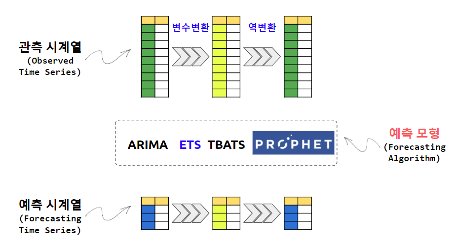

```{r setup, include=FALSE}
knitr::opts_chunk$set(echo = TRUE, message=FALSE, warning=FALSE,
                      comment="", digits = 3, tidy = FALSE, prompt = FALSE, fig.align = 'center')

```

<center>

</center>

# 데이터와 예측모형 [^roger-ts-book] [^fpp] {#corona-univariate}

[^roger-ts-book]: [Roger D. Peng (2020-04-02), "A Very Short Course on Time Series Analysis", bookdown.org](https://bookdown.org/rdpeng/timeseriesbook/)

[^fpp]: [Rob J Hyndman and George Athanasopoulos, "Forecasting: Principles and Practice", Monash University, Australia](https://otexts.com/fppkr/)

앞서 작업한 데이터와 선형회귀모형과 ARIMA 모형을 저장한 `data/corona_fcst_list.rds` 리스트 객체를 단변량 시계열 분석 작업을 위해서 풀어둔다.

```{r arima-load-data-model}
library(tidyverse)
library(tidymodels)

library(timetk)
library(modeltime)

# 데이터 + 모형 ----
corona_fcst_list <- read_rds("data/corona_fcst_list.rds")

# 데이터 ----
full_tbl <- corona_fcst_list$data

# 모형 ----
wkfl_fit_lm <- corona_fcst_list$model$wkfl_fit_lm
wkfl_fit_arima <- corona_fcst_list$model$wkfl_fit_arima
```

# 변수변환 {#corona-univariate-transformation}

`log1p()` 함수는 `base` 팩키지에 포함된 함수로 로그값에 1을 더해 `Inf`가 발생되는 것을 막아준다.
원척도로 되돌리려면 `expm1()` 함수를 사용하면 된다.

```{r visualize-univariate}
library(lubridate)

full_tbl %>% 
  filter(!is.na(확진자)) %>% 
  plot_time_series_regression(.date_var     = 날짜,
                              .formula      = 확진자 ~ as.numeric(날짜) +
                                                       wday(날짜,  label = TRUE) +
                                                       month(날짜, label = TRUE),
                              .show_summary = TRUE,
                              .interactive  = FALSE)
```

```{r visualize-univariate-after}
full_tbl %>% 
  filter(!is.na(확진자)) %>% 
  plot_time_series_regression(.date_var     = 날짜,
                              .formula      = base::log1p(확진자) ~ as.numeric(날짜) +
                                                                    wday(날짜,  label = TRUE) +
                                                                    month(날짜, label = TRUE),
                              .show_summary = TRUE,
                              .interactive  = FALSE)

```

## 훈련/시험 데이터 분할 {#corona-univariate-split}

예측할 데이터와 모형개발에 활용할 데이터로 나눈 후에 
모형개발에 활용할 데이터를 훈련/시험 데이터로 나눈다.

```{r load-data-model}
## 예측 데이터와 모형개발 데이터로 분리
forecast_tbl <- full_tbl %>% 
  filter(is.na(확진자))

history_tbl <- full_tbl %>% 
  filter(!is.na(확진자)) %>% 
  mutate(확진자 = log1p(확진자))

## 훈련/시험 데이터 분할

splits <- history_tbl %>% 
  time_series_split(date_var    = 날짜,  
                    assess      = 30,
                    cumulative  = TRUE)
splits
```

훈련/시험 데이터로 잘 나눠졌는지 시각적으로 확인한다.

```{r load-data-model-viz}
splits %>% 
  tk_time_series_cv_plan() %>% 
  plot_time_series_cv_plan(.date_var = 날짜,
                            .value   = 확진자)
```


# 피처 공학 {#feature-engineering}

`tidymodels` 생태계의 `recipe` 팩키지 `recipe()` 함수를 사용해서 피쳐 공학(feature engineering) 작업을 수행한다.
추후, 다양한 피처를 작업할 예정이라 대략적인 틀만 잡아둔다.

```{r uni-feature-engineering}
recipe_spec <- recipes::recipe(확진자 ~ 날짜, data = training(splits))

recipe_spec %>% prep() %>%  juice()
```

# 단변량 예측 알고리즘 {#algorithm-univariate}

단변량 예측 알고리즘으로 다음 세가지 대표적인 알고리즘을 적용시킨다.

- ARIMA
- ETS
- TBATS
- Prophet

## ARIMA {#algorithm-arima}

대표적인 시계열 데이터 예측모형 ARIMA로 적합시킨다.

```{r arima-fit}

mdl_arima_spec <- arima_reg() %>%
    set_engine("auto_arima")

wkfl_fit_arima <-  workflows::workflow() %>% 
  add_recipe(recipe_spec) %>% 
  add_model(mdl_arima_spec) %>% 
  fit(training(splits))

wkfl_fit_arima
```

## ETS {#algorithm-ets}

지수평활(exponential smoothing) 중 ETS(Error-Trend-Season)를 예측모형으로 적합시킨다.

```{r ets-fit}

mdl_ets_spec <- exp_smoothing(
    error   = "auto",
    trend   = "auto",
    season  = "auto",
    damping = "auto"
) %>%
    set_engine("ets")

wkfl_fit_ets <-  workflows::workflow() %>% 
  add_recipe(recipe_spec) %>% 
  add_model(mdl_ets_spec) %>% 
  fit(training(splits))

wkfl_fit_ets
```

## TBATS {#algorithm-tbats}

TBATS를 예측모형으로 적합시킨다.

```{r tbats-fit}

mdl_tbats_spec <- seasonal_reg(
  mode              = "regression",
  seasonal_period_1 = "auto"
) %>%
    set_engine("tbats")

wkfl_fit_tbats <-  workflows::workflow() %>% 
  add_recipe(recipe_spec) %>% 
  add_model(mdl_tbats_spec) %>% 
  fit(training(splits))

wkfl_fit_tbats
```

## Prophet {#algorithm-prophet}

페이스북에서 개발한 Prophe 예측모형으로 적합시킨다.

```{r prophet-fit}

mdl_prophet_spec <- prophet_reg(
) %>%
    set_engine("prophet")

wkfl_fit_prophet <-  workflows::workflow() %>% 
  add_recipe(recipe_spec) %>% 
  add_model(mdl_prophet_spec) %>% 
  fit(training(splits))

wkfl_fit_prophet
```


# 모형 평가 {#ets-model-evaluate}

`workflow` 객체를 `modeltime` 팩키지 `modeltime_table()` 함수에 넣어 객체로 만든 후에,
추가로 지수평활법 EST 예측모형을 추가한다.
`modeltime_accuracy()` 함수를 사용해서 모형 성능을 파악한다.

```{r evaluate-model-performance}
model_tbl <- modeltime_table(
    wkfl_fit_arima,
    wkfl_fit_ets,
    wkfl_fit_tbats,
    wkfl_fit_prophet
    ) %>% 
  update_model_description(.model_id = 1, "ARIMA") %>% 
  update_model_description(.model_id = 2, "ETS") %>% 
  update_model_description(.model_id = 3, "TBATS") %>% 
  update_model_description(.model_id = 4, "Prophet")

model_tbl %>% 
  modeltime::modeltime_accuracy(testing(splits))
```

## 시각화 {#model-calibration-viz-ets}

시험데이터를 통해 모형으로 예측한 값을 시각화한다. 
ETS MAE 값이 ARIMA 예측모형과 별다른 차이가 나고 있지 않지만, 
신뢰구간이 생긴 것은 그나마 다행이다.

```{r arima-evaluate-model-ets}
calibration_tbl <- model_tbl %>% 
  modeltime_calibrate(
    new_data = testing(splits)
  )

calibration_tbl %>% 
    modeltime_forecast(
        new_data      = testing(splits),
        actual_data   = history_tbl,
        keep_data     = TRUE,
        conf_interval = 0.10
    ) %>%
    mutate(
        across(.cols = c(.value, 확진자), .fns = expm1) # log1p --> expm1 원척도로 변환
    ) %>% 
    plot_modeltime_forecast(
        .legend_max_width    = 60,
        .legend_show         = TRUE,
        .conf_interval_show  = TRUE,
        .conf_interval_alpha = 0.20,
        .conf_interval_fill  = "lightblue",
        .title = "코로나19 확진자 1개월 예측"
    )
```

# 확진자 예측 {#arima-model-forecast}

앞선 모형은 `history_tbl` 을 훈련/시험 데이터에 대해 적합을 시킨 것이라 ... 이제 시간을 확대하여 `modeltime_refit()` 함수를 사용해서 모형을 전체 데이터에 대해 다시 적합시킨다.

```{r arima-evaluate-model-forecast-refit}
refit_tbl <- calibration_tbl %>% 
  modeltime_refit(data = history_tbl)
```

마지막으로 앞서 구축된 모형을 바탕으로 현재까지 입수된 데이터를 바탕으로 한달 후를 예측한다.

```{r arima-evaluate-model-forecast}
refit_tbl %>% 
  modeltime_forecast(
    new_data    = forecast_tbl,
    actual_data = history_tbl,
    conf_interval = 0.3
  )  %>%
  mutate(
        across(.cols = c(.value), .fns = expm1) # log1p --> expm1 원척도로 변환
  ) %>% 
  plot_modeltime_forecast(
      .legend_max_width = 25,
      .conf_interval_fill = "lightblue",
      .conf_interval_alpha = 0.7,
      .interactive = TRUE
  )
```

# 모형과 데이터 저장 {#save-model-forecast}

마지막 단계로 데이터와 모형을 저장하여 다음 단계로 나가기 위한 작업을 수행한다.

```{r ets-save-model-dataset}
corona_fcst_list <- list(
  
  # 데이터 ---
  data = full_tbl, 
  
  # 예측모형 ----
  model = list(
    wkfl_fit_lm      = wkfl_fit_lm,
    wkfl_fit_arima   = wkfl_fit_arima,
    wkfl_fit_ets     = wkfl_fit_ets,
    wkfl_fit_tbats   = wkfl_fit_tbats,
    wkfl_fit_prophet = wkfl_fit_prophet
  )
)

# 모형 + 데이터 저장 ----
corona_fcst_list %>% 
  write_rds("data/corona_fcst_list.rds")
```
